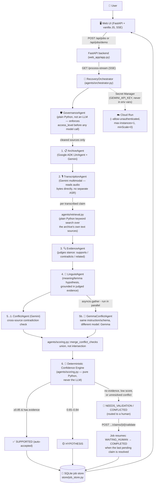

# Language Recovery OS: Turn Fragmented Language Archives Into Living, Validated Knowledge

[](https://github.com/google/adk)
[](https://aistudio.google.com/)
[](https://cloud.google.com/run)
[](LICENSE)

> Built for the official **Google Cloud "All Things Agentic" Hackathon** ($180,000 USD Prize Pool) under **The Collaborative Partner** category.

**Live demo:** https://language-recovery-os-520298138105.us-central1.run.app

---

## 🌟 Overview & Problem Statement

Endangered- and low-resource-language archives already contain decades of recordings, dictionaries, grammars and field notes. The problem isn't that the data doesn't exist — it's that turning it into a structured, reusable digital resource is slow, fragmented and heavily manual, and requires specialized linguistic training most communities and small archives don't have on hand.

**Language Recovery OS is not a translator, a chatbot, or a "Duolingo for Indigenous languages."** It doesn't pretend a model "knows" a language it has almost no training data for. It gives autonomous agents the archive and one goal — *"process this archive"* — and they classify materials, propose transcriptions, retrieve supporting/contradicting evidence from the archive's own dictionary/grammar/corpus, detect cross-source conflicts, and route only the genuinely uncertain cases to a human. Every claim the system produces carries its evidence and provenance; nothing is shown as fact without a traceable source.

The demo uses **Mapudungun** (a living Indigenous language of southern Chile/Argentina) as a demonstration dataset — the system itself is language-agnostic: it reasons from whatever archive it's given, not from pretrained knowledge of a specific language.

---

## 🏗️ Architecture



**No knowledge without provenance, and no LLM ever makes the final accept/escalate call.** The confidence engine is deterministic Python with two hard rules an LLM is never trusted to apply to itself: (1) a claim with zero supporting evidence can never auto-accept, no matter how confident the transcription step was; (2) a claim with an unresolved cross-source conflict always routes to human validation, regardless of score.

*(Honest scope note: the architecture above is what actually runs today — a single Cloud Run service, an ADK/Gemini agent pipeline, plain-Python evidence search, and SQLite for job state. Firestore, a managed RAG Engine and a graph database like Spanner Graph are documented upgrade paths for scaling beyond a hackathon demo, not part of the current build.)*

---

## 🤖 The Agent Pipeline

| Agent | Role & Responsibility |
| :--- | :--- |
| **GovernanceAgent** | Deliberately *not* an LLM. Enforces `access_level` (`PUBLIC` / `COMMUNITY_ONLY` / `RESEARCH_ONLY` / `RESTRICTED` / `SACRED_DO_NOT_PROCESS`, set by the human who uploaded the source) before any content reaches a model call — restricted/sacred material never leaves the server. |
| **ArchiveAgent** | Inventories every governance-cleared source (a short text excerpt per document) and proposes a workflow plan. |
| **TranscriptionAgent** | For each audio source, reads the audio bytes directly with Gemini's multimodal input (no dedicated ASR pipeline) and returns segmented, ranked transcription hypotheses with explicit confidence. |
| **EvidenceAgent** | Given candidate snippets found by a plain-Python keyword search over the archive's dictionary/grammar/corpus, judges each one's stance (`supports` / `contradicts` / `related`) and support strength. |
| **LinguistAgent** | Proposes a meaning/lemma/morpheme hypothesis grounded only in the judged evidence — always framed as a hypothesis, never asserted as fact. |
| **ConflictAgent** | Checks the judged evidence and any variants for genuine cross-source contradictions (e.g. a 1974 dictionary entry vs. a 2019 community recording). |
| **GemmaConflictAgent** | **Independent second opinion on Gemma** (a genuinely different model family, run concurrently with the Conflict Agent via `asyncio.gather`): re-checks the exact same evidence/variants with the identical instruction/schema. A real conflict either model raises is kept, never silently dropped — `agents/scoring.py::merge_conflict_checks` unions both reads, because a false negative here is worse than an extra claim routed to human validation. Directly reinforces section 7.7 of the master spec ("a claim with an unresolved conflict always routes to human validation"). Degrades to Gemini's read alone if Gemma is unavailable. |
| **Deterministic Confidence Engine** (`agents/scoring.py`) | Combines transcription confidence (35%), evidence support (35%) and cross-source agreement (30%), applies a conflict penalty, and maps the result to `SUPPORTED` / `HYPOTHESIS` / `NEEDS_VALIDATION` / `CONFLICTED` — pure Python, the only place a claim's status is ever decided. |

All LLM-backed agents run as real `google.adk` `LlmAgent`s through an `InMemoryRunner`, with retry + timeout handling (`agents/orchestrator.py::_run_agent`) so a stalled Gemini call can never hang a Cloud Run request indefinitely.

---

## 🚀 Quick Start & Local Setup

### Prerequisites
* Python 3.12+
* A free Gemini API key from [Google AI Studio](https://aistudio.google.com/)

### 1. Clone & Install Dependencies
```bash
git clone https://github.com/yobanrg6-coder/language-recovery-os.git
cd language-recovery-os
pip install -r requirements.txt
```

### 2. Configure Environment
```bash
cp .env.example .env
```
Edit `.env` and set your key:
```env
GEMINI_API_KEY=your_actual_gemini_api_key
MODEL=gemini-flash-lite-latest
```
`gemini-flash-lite-latest` is the default because it's the current stable multimodal-capable alias — pinned model names get retired from new accounts without notice, the `-latest` alias always resolves to Google's current recommended model.

### 3. Run the App
```bash
python run.py
```
Open your browser at **`http://127.0.0.1:8000`**. Click **"Load Mapudungun demo archive"** for the curated one-click demo, or **"Upload my own files"** to process any archive of your own (audio, dictionary, grammar or corpus text) — the pipeline is not hardcoded to Mapudungun.

### 4. Run the test suite
```bash
pytest tests/
```
Covers the deterministic confidence engine (`test_scoring.py`): a claim without evidence can never auto-accept, high-confidence + strong evidence does auto-accept, an unresolved conflict forces human validation even at a high score, and a human validation updates the claim correctly.

---

## ☁️ Google Cloud Run Deployment

```bash
# Build & deploy directly from source - Cloud Run builds the container itself
# from the Dockerfile, no local Docker or separate gcloud builds step needed.
gcloud run deploy language-recovery-os --source . --region=us-central1

# The Gemini key is never passed as a plain --set-env-vars value (that leaks
# it into shell history and Cloud Run's own config metadata) - store it in
# Secret Manager once, then reference it by name on deploy:
echo -n "your_actual_gemini_api_key" | gcloud secrets create gemini-api-key --data-file=-
gcloud run deploy language-recovery-os --source . --region=us-central1 \
    --allow-unauthenticated --min-instances=1 --max-instances=1 --timeout=900 \
    --set-env-vars WEB_APP_HOST=0.0.0.0,MODEL=gemini-flash-lite-latest \
    --set-secrets GEMINI_API_KEY=gemini-api-key:latest
```

`--min-instances=1` keeps a warm instance running so judges never hit a cold-start abort
(`"no available instance"` 500) on the first request after idle.

`--timeout=900` raises Cloud Run's per-request deadline from the 300s default: the recovery
pipeline is one long SSE response, and a multi-segment audio archive (transcription retries +
per-claim evidence/linguist/conflict calls) can run past 5 minutes. If the request is killed
mid-stream the job is persisted as `FAILED` and can be re-run, but the longer deadline avoids
the interruption in the first place.

---

## 📦 Demo Data & Licensing

The Mapudungun demo archive (`demo_data/`) is built entirely from public-domain and Creative-Commons-licensed sources — see [`demo_data/SOURCES.md`](demo_data/SOURCES.md) for the full citation and license of every file (Augusta's 1916 dictionary and 1903 grammar, both public domain via archive.org; a cleaned excerpt of the AVENUE Mapudungun corpus, CC BY-NC-SA 3.0; a real speaker recording from Wikitongues, CC BY 3.0).

---

## 🏆 Author & Hackathon Verification
* **Developer:** Jose (Yoban) Rodríguez
* **Google Cloud Public Profile:** [skills.google/public_profiles/6bac5b41-ee95-4a9a-b9ee-d871c4e31106](https://www.skills.google/public_profiles/6bac5b41-ee95-4a9a-b9ee-d871c4e31106) *(12 Official Skill Badges & GEAR Certified)*
* **License:** MIT
